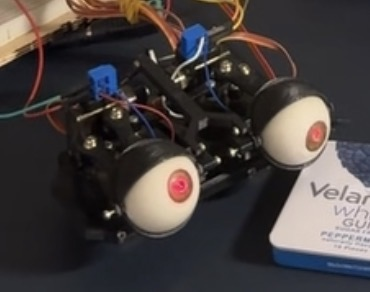

# lasereyes bitch
# Hardware
 This project uses a raspberry pi 5 with a camera module v3, the rpi ai kit with the M.2 Hat+, and an adafruit PCA9685 16 Channel servo driver, which drives the 6 servos and two HiLetgo 5V 650nm 5mW red diode laser beams. 3D print files can be found under ./3d_print, and was highly influenced by Will Cogley's eye mech δ1.0 design, but this will probably change soon, because the field of view is honestly so ass. Link to Will Cogley's design found at https://willcogley.notion.site/Will-Cogley-Project-Archive-75a4864d73ab4361ab26cabaadaec33a?p=fee129fa32a443749f88524f53702f5a&pm=c 
## Here is a final setup of the hardware:


# Software
## Closed-Loop Laser Eye Tracking: OOP Architecture Design
```
┌─────────────────────────────────────────────────────────────┐
│         LaseEyeController (Main Command & Control)          │
│  - Orchestrates all subsystems                              │
│  - Manages loop cycle (inference → tracking → servo update) │
└────────┬─────────────────────┬──────────────────────────────┘
         │                     │
    ┌────▼─────┐         ┌────▼──────────────┐
    │ServoCtrl  │         │  PoseDetector    │
    │- Write to │         │  - Runs YOLO11   │
    │  servos   │         │  - Extracts eyes │
    │- Manage   │         │  - Face keypts   │
    │  limits   │         │  - Normalizes    │
    └────┬─────┘         └────┬──────────────┘
         │                     │
    ┌────┴──────────────────────┴─────────────┐
    │                                          │
    │     ┌──────────────────────────────┐    │
    │     │   LaserDetector              │    │
    │     │  - Processes frame for laser │    │
    │     │  - Detects red dots          │    │
    │     │  - Returns (x, y) positions  │    │
    │     └──────────────────────────────┘    │
    │                                          │
    │     ┌──────────────────────────────┐    │
    │     │   TrackingController         │    │
    │     │  - Multi-target tracking     │    │
    │     │  - Kalman filtering          │    │
    │     │  - Error calculation         │    │
    │     │  - Command generation        │    │
    │     └──────────────────────────────┘    │
    │                                          │
    └──────────────────────────────────────────┘

Main Loop (in LaseEyeController):
    while True:
        frame = camera.capture()
        
        # 1. Detect target (human eyes)
        target_eyes = pose_detector.detect(frame)
        
        # 2. Detect achieved laser position
        laser_dots = laser_detector.detect(frame)
        
        # 3. Track and compute error
        commands = tracking_controller.update(
            target_eyes, 
            laser_dots, 
            dt
        )
        
        # 4. Execute servo commands
        servo_controller.set_angles(commands)
        
        dt = time.time() - start_time
```
## Signal Processing
 Use classical signal processing to pick out red laser dots in a scene. use principles from Analyzing sesnor data class from jhuapl strategic ed course. 

## Pose Estimation: YOLO11-Pose Nano
### Quick Start
```bash
# Install ultralytics
pip3 install ultralytics

# Download pretrained model (auto-downloads on first use)
python3 -c "from ultralytics import YOLO; YOLO('yolo11n-pose.pt')"
```

### Basic Usage
```python
from ultralytics import YOLO

# Load pretrained model (auto-downloads if not present)
model = YOLO('yolo11n-pose.pt')

# Run inference
results = model(frame)  # Returns pose keypoints for all detected people
```

### Key Details
- **Model**: `yolo11n-pose.pt` (Nano - ~2.6 MB, fastest on RPi5)
- **Keypoints**: 17 points (body) + head points; detects human pose
- **Speed**: ~30-50ms on RPi5 AI Kit GPU
- **Accuracy**: 70-75% mAP (sufficient for eye tracking)
- **Inference**: `results[0].keypoints.xy` gives pixel coordinates

### Configuration in config.yaml
```yaml
models:
  pose: "yolo11n-pose.pt"  # Model will auto-download on first use
  laser: "path/to/laser_detector.pt"  # Your trained laser dot detector
```

### References
- Docs: https://docs.ultralytics.com/tasks/pose/
- GitHub: https://github.com/ultralytics/ultralytics/
- Model Cards: https://docs.ultralytics.com/models/yolo11/#supported-tasks

# Helpful Documentation
## Raspberry Pi
 Setup for the Raspberry pi 5, camera module v3, and rpi ai kit can all be found at https://www.raspberrypi.com/documentation/
## Rpi over ethernet
 https://discuss.luxonis.com/d/29-ssh-connecting-macbook-pro-to-raspberry-pi-over-direct-ethernet for connecting mac to rpi over ethernet. Need to enable internet sharing to dongle ( AX99179A ) - or whatever rpi is directly connected to computer - and make sure its  connected in networks. Then connect to rpi directly through ssh with the following command:
 `ssh -X felipster16@raspberrypi.local`
## X11 Forwarding
 installed XQuartz to enable X11 forwarding to be able to open windows of rpicam video stream over ssh. This was a pain in the ass. need to have command be for stream to work, and also some other settings, and a lot of rpi-reboots and a mac restart lmao:
 rpicam-hello -t 10s --qt-preview
## AdaFruit Servo Driver:
 Setup up for the Servo driver can be found at https://learn.adafruit.com/adafruit-16-channel-servo-driver-with-raspberry-pi. The script blinkatest.py is used to make sure your rpi is ready for use with the servo driver, which tests that I2C is accesible through adafruit_blinka CircuitPython solution. installing circuit python can be found here: https://learn.adafruit.com/circuitpython-on-raspberrypi-linux/installing-circuitpython-on-raspberry-pi
 
 `pip3 install adafruit-circuitpython-pca9685 and adafruit-circuitpython-servokit`
## Red Diode Lasers
1. the red lasers are to operate at less than 20 mA, so must connect a resistor (~ 50 ohms) to PWM output of one of the servo channels which is running at maximum of 25 mA (each channel has 220 ohms added on to its 5V+ supply). max 5V / (220 + 50 Ohms) = 18.5 mA Data from https://learn.adafruit.com/16-channel-pwm-servo-driver/pinouts 
2. -OR- Just connect to 3v supply from rpi pinout with same resistor

commands to control channel for diode led
`import board`
`import busio`
`import adafruit_pca9685`
`i2c = busio.I2C(board.SCL, board.SDA)`
`pca = adafruit_pca9685.PCA9685(i2c)`

Set Frequency of entire pca
`pca.frequency = 60`

Select which channel for led/diode
`led_channel = pca.channels[0]`

Set Brightness of diode
`led_channel.duty_cycle = 0xffff, full brightnss`

## useful I2C commands
check i2c connections: 
`sudo i2cdetect -y 1`

# IDEAS:
 Implementing Extended Kalman Filter for orientation correction, optimal guidance for target tracking, and train yolov7 for laser dot recognition? Will use azimuth elevetion state (or potentially pitch yaw euler angles?) for each eye, where they are mirror images of eachother -- take advantage of this